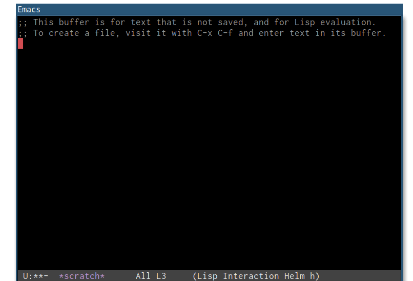

> It didn't take long to discover that his main occupation, even when he wasn't keeping records of his  behavior, was centered on keeping records of everything else. Astonishing as it must have seemed to any self-respecting scientist like himself, his observations revealed that about 85% of his "thinking" time was actually spent "getting into a position to think, to make a decision, to learn something I needed to know. Much more time went into finding or obtaining information than into digesting it."
> -- Howard Rheingold, [Tools for Thought](http://www.rheingold.com/texts/tft/7.html)

# Emacs Velocity: search, browse, create notes

- Multiple formats: org, markdown, and an API for adding more
- Flexible about what a "note" is: entire file, level-1 heading, level-2 heading, ...
- Results organized in conceptual sections, e.g. "Programming Notes", "Package READMEs", ...

Inspired to [Notational Velocity](http://notational.net).

---

<!-- markdown-toc start - Don't edit this section. Run M-x markdown-toc-generate-toc again -->
**Table of Contents**

- [Emacs Velocity: search, browse, create notes](#emacs-velocity-search-browse-create-notes)
    - [Demo](#demo)
    - [Requirements](#requirements)
    - [Installation](#installation)
    - [Configuration](#configuration)
        - [Examples of search configurations](#examples-of-search-configurations)
        - [Examples of target configurations](#examples-of-target-configurations)
        - [Currently available backends](#currently-available-backends)
    - [Usage](#usage)
        - [Searching notes](#searching-notes)
        - [Creating notes](#creating-notes)
        - [Tips](#tips)
    - [Contributing](#contributing)
    - [Related work](#related-work)

<!-- markdown-toc end -->

## Demo


## Requirements

Currently supports [Helm](https://github.com/emacs-helm/helm) as frontend.

## Installation

Download this repository and add it to Emacs's `load-path`. MELPA coming soon.

## Configuration

In your Emacs's init file (`~/.emacs` or `~/.emacs.d/init.el`) bind `helm-velocity` to a key combination, e.g.:

```
(global-set-key (kbd "C-c r") 'helm-velocity)
```

Then use `velocity-define-searches-1` to define where notes should be searched and `velocity-define-targets-1` to define where notes should be created.

### Examples of search configurations

Search level-1 notes in one org file:

```
(velocity-define-searches-1
 '("My Notes"
   (:backend org-heading-1
    :files ("~/notes.org"))))
```

Search level-1 notes in multiple org files:

```
(velocity-define-searches-1
 '("My Notes"
   (:backend org-heading-1
    :files ("~/notes.org" "~/foobar.org"))))
```

Same as above, plus level-2 notes in another file:

```
(velocity-define-searches-1
 '("My Notes"
   (:backend org-heading-1
    :files ("~/notes.org" "~/foobar.org"))
   (:backend org-heading-2
    :files ("~/todo.org"))))
```

Same as above, plus some markdown files with one note per file:

```
(velocity-define-searches-1
 '("My Notes"
   (:backend org-heading-1
    :files ("~/notes.org" "~/foobar.org"))
   (:backend org-heading-2
    :files ("~/todo.org"))
   (:backend markdown-file
    :files "~/notes/*.md")))
```

Same as above, plus some READMEs from cloned repositories; display the latter in a separate section:

```
(velocity-define-searches-1
 '("My Notes"
   (:backend org-heading-1
    :files ("~/notes.org" "~/foobar.org"))
   (:backend org-heading-2
    :files ("~/todo.org".org"))
   (:backend markdown-file
    :files "~/notes/*.md"))

 '("READMEs"
   (:backend markdown-file
    :files "~/src/*/README.md")))
```

Same as above, plus level-1 notes in all `org-agenda-files` (note the use of the backtick before `("My Notes"` to later allow expand `org-agenda-files`):

```
(velocity-define-searches-1
 `("My Notes"
   (:backend org-heading-1
    :files ("~/notes.org" "~/foobar.org" ,@org-agenda-files))
   (:backend org-heading-2
    :files ("~/todo.org".org"))
   (:backend markdown-file
    :files "~/notes/*.md"))

 '("READMEs"
   (:backend markdown-file
    :files "~/src/*/README.md")))
```

### Examples of target configurations

Create notes as level-1 headings in `~/notes.org` or `~/scratch.org`, or as markdown files under `~/notes` with user input as filename:

```
(velocity-define-targets-1
   '(:file "~/notes.org" :backend org-heading-1)
   '(:file "~/scratch.org" :backend org-heading-1)
   '(:file "~/notes/%s.md" :backend markdown-file))
```

### Currently available backends

- `org-heading-1`
- `org-heading-2`
- `markdown-file`
- `markdown-heading-1`
- `markdown-heading-2`

## Usage

### Searching notes

Invoke `helm-velocity` and write some words. Matching notes will appear in the helm buffer.

### Creating notes

When the input is longer than 15 characters, Velocity guesses that the user is writing the title of a new entry instead of a search query, and displays a list of possible targets; if any of those is selected, a new note is created in the target and displayed to the user.

### Tips

Follow-mode is enabled by default. To disable it, invoke `C-c C-f` during the helm session.

## Related work

- [Notational Velocity](http://notational.net/)
- Other Emacs modules with similar purposes: [org-velocity](http://orgmode.org/worg/org-contrib/org-velocity.html), [deft](https://jblevins.org/projects/deft/), [helm-org](https://github.com/emacs-helm/helm/blob/master/helm-org.el), [helm-rifle](https://github.com/alphapapa/helm-org-rifle), [helm-browse](https://github.com/michael-heerdegen/helm-browse)
